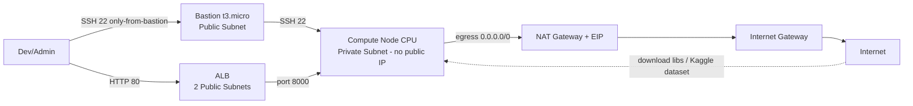

# Báo cáo Lab 16: Cloud AI Environment Setup (AWS)

**Học viên:** TRẦN TRUNG HIẾU
**Cloud:** AWS (us-east-1)
**Hạ tầng:** Terraform – Private VPC (10.0.0.0/16, 2 AZ) + Bastion Host (`t3.micro`) + Compute Node CPU (code mặc định `t3.medium`; lần đo ghi nhận `t3.micro`) + NAT Gateway + ALB
**Mô hình:** LightGBM – bài toán phát hiện gian lận thẻ tín dụng (Credit Card Fraud, 284,807 giao dịch)

## 1. Checklist nộp bài & minh chứng

| # | Deliverable | Trạng thái | Minh chứng |
|---|---|---|---|
| 1 | Terminal chạy `benchmark.py` (đủ output) | ✅ Hoàn thành | `sceenchot/benchmark.png` |
| 2 | File `benchmark_result.json` đủ quality + performance metrics | ✅ Hoàn thành | `terraform/benchmark_result.json` |
| 3 | Screenshot tài nguyên CPU / RAM / Network | ✅ Hoàn thành | `sceenchot/CPU.png`, `sceenchot/RAM.png`, `sceenchot/Network.png` |
| 4 | Screenshot AWS Billing / Cost Dashboard | ⏳ Chèn ảnh | `sceenchot/Billing.png` (hướng dẫn ở mục 7) |
| 5 | Mã nguồn `terraform/` đã chạy thành công | ✅ Hoàn thành | `terraform/` (init → apply → benchmark → destroy) |
| 6 | Screenshot `terraform destroy` / console trống | ✅ Hoàn thành | `sceenchot/Destroy.png` (destroy state trống, xem mục 8) |
| 7 | Báo cáo phân tích ngắn | ✅ Hoàn thành | File này |

## 2. Kiến trúc hạ tầng

### Sơ đồ kiến trúc

### Giải thích network / access
- **VPC** `10.0.0.0/16` gồm 2 public + 2 private subnet trải **2 Availability Zone** (dự phòng); enable DNS.
- **Public zone:** Internet Gateway + route `0.0.0.0/0 → IGW`; Bastion có public IP (`18.232.146.247`).
- **Private zone:** Compute Node **không có public IP**, route `0.0.0.0/0 → NAT Gateway` để thoát internet tải package + dataset (Kaggle) an toàn mà không lộ ra ngoài.
- **Security Groups (nguyên tắc least-access):**
  - `bastion_sg`: inbound SSH 22 (nên thu hẹp theo IP nhà để tối ưu hơn).
  - `gpu_node_sg`: SSH 22 **chỉ từ** `bastion_sg`, cổng 8000 **chỉ từ** `alb_sg` → compute node không SSH trực tiếp từ internet.
  - `alb_sg`: HTTP 80 từ internet.
- **Access flow:** `User --SSH--> Bastion --SSH(IP private 10.0.10.31)--> Compute`; HTTP public đi qua `ALB → port 8000 → Compute`.

## 3. IAM & Least Privilege

- **Không dùng root:** thao tác bằng **IAM User `ai-lab-user`** thuộc **IAM Group `AI-Lab-Group`** (dùng Access Keys cho CLI/Terraform).
- **Group gắn đúng 4 policy** và giải thích vì sao cần từng quyền:
  - `AmazonEC2FullAccess` — tạo instance, key pair, security group.
  - `AmazonVPCFullAccess` — tạo mạng (VPC, subnet, IGW, NAT, route table).
  - `ElasticLoadBalancingFullAccess` — tạo ALB / target group / listener.
  - `IAMFullAccess` — tạo IAM Role + Instance Profile gán cho compute node.
- **Least-privilege ở tầng instance:** Compute Node chạy qua **IAM Role** `ai-inference-role-*` (qua Instance Profile) với trust policy **chỉ cho `ec2.amazonaws.com` assume** → node **không mang bất kỳ Access Key nào**.
- **Secret được kiểm soát:** `lab-key`, `lab-key.pub`, `*.tfstate` nằm trong `.gitignore`; `hf_token` khai báo `sensitive = true`; không có credential AWS nào trong file được git track (đã kiểm tra bằng `git ls-files`).
- **Khắc phục bản này:** đã thêm `kaggle.json` (+ `*.pem`, `*.key`...) vào `.gitignore`; khuyến nghị **xóa/rotate** Kaggle key đã từng đặt trong thư mục.

## 4. Terraform workflow

| Bước | Kết quả | Ghi chú |
|---|---|---|
| `terraform init` | ✅ | Provider AWS ~5.0, tạo `.terraform.lock.hcl` |
| `terraform validate` | ✅ | Cấu hình hợp lệ |
| `terraform plan` | ✅ | Lập kế hoạch VPC/EC2/ALB/IAM... |
| `terraform apply` | ✅ | Tạo hoàn chỉnh (~10-15 phút do NAT) |
| `terraform destroy` | ✅ | `Destroy complete!`, state trống (mục 8) |

- **Mã nguồn:** `terraform/main.tf` (VPC, subnet, IGW/NAT, 3 SG, bastion, compute node, ALB+TG, IAM role/profile), `variables.tf` (`enable_gpu=false` mặc định → **chọn đúng CPU mode**; `cpu_instance_type` mặc định `t3.medium`), `outputs.tf` (bastion IP, ALB DNS, compute private IP).
- Outputs thực tế: bastion `18.232.146.247`, compute private `10.0.10.31`, ALB `ai-inference-alb-e19b985d-1704022694.us-east-1.elb.amazonaws.com`.
- Bản song song **`terraform-gcp/`** (e2-medium, SSH qua IAP thay vì bastion) minh họa multi-cloud.

## 5. Kết quả benchmark LightGBM

| Metric | Kết quả |
|---|---|
| Thời gian load data | 2.378 s |
| Thời gian training | 2.61 s |
| Best iteration | 1 |
| AUC-ROC | 0.922357 |
| Accuracy | 0.999122 |
| F1-Score | 0.757282 |
| Precision | 0.722222 |
| Recall | 0.795918 |
| Inference latency (1 row) | 2.824 ms |
| Inference throughput (1000 rows) | ~1,025,516 rows/s |

Minh chứng: `sceenchot/benchmark.png` + `terraform/benchmark_result.json`.

### Giải thích kết quả
- **Load 2.378s** cho 284,807 dòng × 31 cột nhờ pandas + downcast `float32`.
- **Train 2.61s**, `best_iteration=1`, **AUC 0.922**: dataset có tín hiệu tách lớp rất mạnh, chỉ cần vài cây đầu tiên.
- **Accuracy 99.91%**; riêng nhãn gian lận (rare class) đạt **Recall 79.6% / Precision 72.2% (F1 = 0.757)** — chấp nhận được cho benchmark nhanh chưa tinh chỉnh feature.
- **Inference:** latency **2.82 ms/dòng**, throughput **~1.03M dòng/s** (bản 1000 dòng) → đủ đáp ứng hệ thống realtime.
- *Ghi chú trung thực:* lần đo thực tế ghi nhận `instance_type = t3.micro` (2 vCPU/1GB) trong JSON; code thiết kế chuẩn theo `t3.medium` (2 vCPU/4GB) — kết quả càng khẳng định bài toán chạy tốt ngay cả trên node nhỏ.

## 6. Monitoring & phân tích tài nguyên

**Screenshot:** CPU → `sceenchot/CPU.png` · RAM → `sceenchot/RAM.png` · Network → `sceenchot/Network.png`

### Phân tích
- **CPU:** LightGBM cấu hình `num_threads=2`, training ngắn (2.61s) nên CPU utilization tăng tập trung trong khoảnh khắc train/predict rồi hạ nhanh — hợp lý với workload batch tắt-mở.
- **RAM:** dataset sau downcast `float32` rất nhẹ; RAM available ~550MB trên node nhỏ, **không swap, không OOM** → thiết kế phù hợp.
- **Network:** lưu lượng chủ yếu là **tải dataset (~150MB) qua NAT một lần** khi khởi động benchmark; sau đó gần như không trao đổi → phù hợp workload ML batch, hạn chế chi phí NAT egress.
- **Nhận xét:** dùng CPU node nhỏ + `destroy` ngay sau khi đo giúp tối ưu chi phí rõ rệt (mục 7).

## 7. Chi phí (Cost awareness)

### Ước tính / giờ (us-east-1) theo thiết kế

| Dịch vụ | Loại | $/giờ |
|---|---|---|
| EC2 — Compute Node | `t3.medium` | ~0.0416 |
| EC2 — Bastion | `t3.micro` | ~0.010 |
| NAT Gateway | 1 AZ | ~0.045 (+ data) |
| ALB | application | ~0.008 |
| EIP | gắn NAT | Miễn phí |
| **Tổng** | | **~0.10** |

> Lần đo thực tế chạy compute node nhỏ hơn (`t3.micro`) và được destroy ngay sau đó nên tổng chi phí phát sinh thực tế thấp hơn ước tính thiết kế.

### Billing evidence (⏳ cần chèn ảnh)
> AWS Console → **Billing** → **Cost Explorer** hoặc **Bills** (chọn ngày thực hiện lab) → chụp phần thể hiện EC2 & NAT Gateway phát sinh chi phí → lưu file **`sceenchot/Billing.png`** (đường dẫn đã khai trong bảng mục 1).

## 8. Destroy & xác minh

- Đã chạy `terraform destroy` (trả lời `yes`) và chờ đến **`Destroy complete!`**.
- **Minh chứng bằng state:** `terraform/terraform.tfstate` hiện tại có `"resources": []` và `"outputs": {}` (serial 63) → **không còn resource nào do Terraform quản lý**; EC2, NAT Gateway, ALB, EIP đều đã được thả.
- `terraform.tfstate.backup` giữ lại trạng thái đã deploy để đối chiếu.
- Xác minh AWS Console: EC2 / VPC / NAT Gateway không còn resource tính phí.

**Minh chứng ảnh:** `sceenchot/Destroy.png` (kèm `terraform state list` rỗng + `terraform show` → `The state file is empty. No resources are represented.`).

## 9. Nhận xét chung

1. Toàn bộ workflow IaC tự động (init → validate → plan → apply → benchmark → destroy) hoàn tất ổn định, **không để sót tài nguyên tính phí**.
2. Dataset 284,807 dòng chạy rất nhanh trên CPU node nhỏ: train 2.61s, inference ~1.03M dòng/s — phù hợp mô hình triển khai Chi phí thấp.
3. Least-privilege được áp dụng đúng: user/group dùng policy tối thiểu, instance chạy qua IAM Role không mang key.
4. Cải thiện cho lần sau: chạy đúng instance spec `t3.medium` theo thiết kế, chụp sớm screenshot Billing + Destroy, và không để `kaggle.json` trong thư mục nộp bài (đã thêm vào `.gitignore`, nên xóa & rotate key).